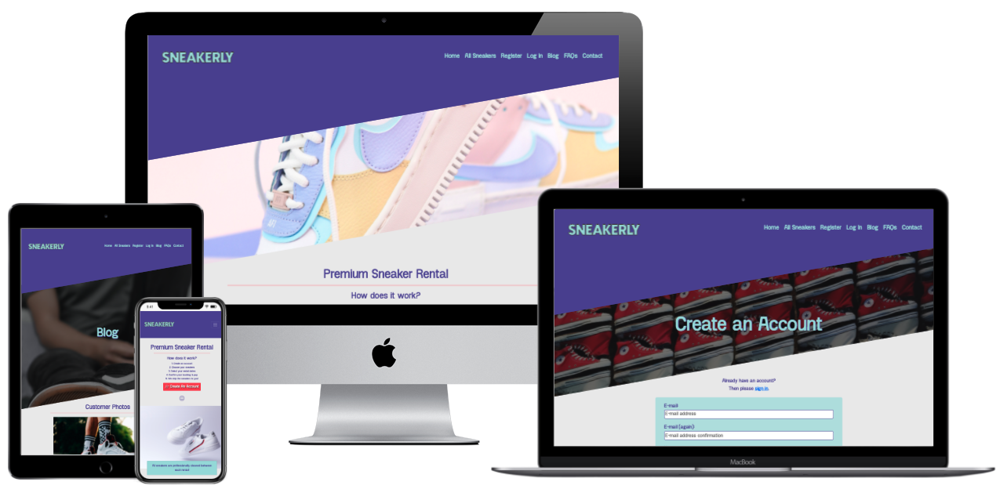

<h1 align="center">Sneakerly</h1>

[View the deployed site here.](https://ms4-sneakerly.herokuapp.com/)

Sneakerly is a sneaker rental websitw that allows users to rent premium sneakers from a reputable source. This website was created for submission as my Milestone Project 4 as part of the Diploma in Full Stack Software Development course with Code Institute. 
 
## User Experience (UX)

The sneaker industry is undergoing a period of huge growth, with popular sneakers selling out instantly from retailers, and being re-sold at after-market values much higher than the original retail value. 
This site advances the user's goals by allowing users to rent premium sneakers at affordable prices, allowing them to have the full experience of wearing sought-after styles, without needing to pay huge reseller prices, and without needing to compete against automated purchase bots on retailer websites. 
It advances the site owner's goals by providing them with a means to make money from rentals, and they will also be allowed to charge customers late/missing/damaged fees. 

The User Experience for this site was planned & developed using the [5 Planes of UX Design](https://medium.com/designcentered/ux-design-5-planes-method-b1b1d6587c05): Strategy, Scope, Structure, Skeleton, Surface.

### Strategy
#### User Stories

### Scope
#### Existing Features

#### Future Planned Features

### Structure
#### Flowchart
- Flowchart created using [Lucidchart](https://www.lucidchart.com): 
    [Flowchart PNG](/readme-assets/images/sneakerly-flowchart-2.png)

### Skeleton
#### Wireframes
- Wireframes created using [Balsamiq](https://balsamiq.com/): 
    [Wireframes PDF](/readme-assets/sneakerly-wireframes2.pdf)

### Surface

- Color Scheme:

- Typography:

- Images:

## Technologies Used

### Tools

### Front-End Technologies

### Back-End Technologies

## Testing

## Deployment
### Local Deployment

### Remote Deployment

## Credits

### Content

### Media

### Acknowledgements