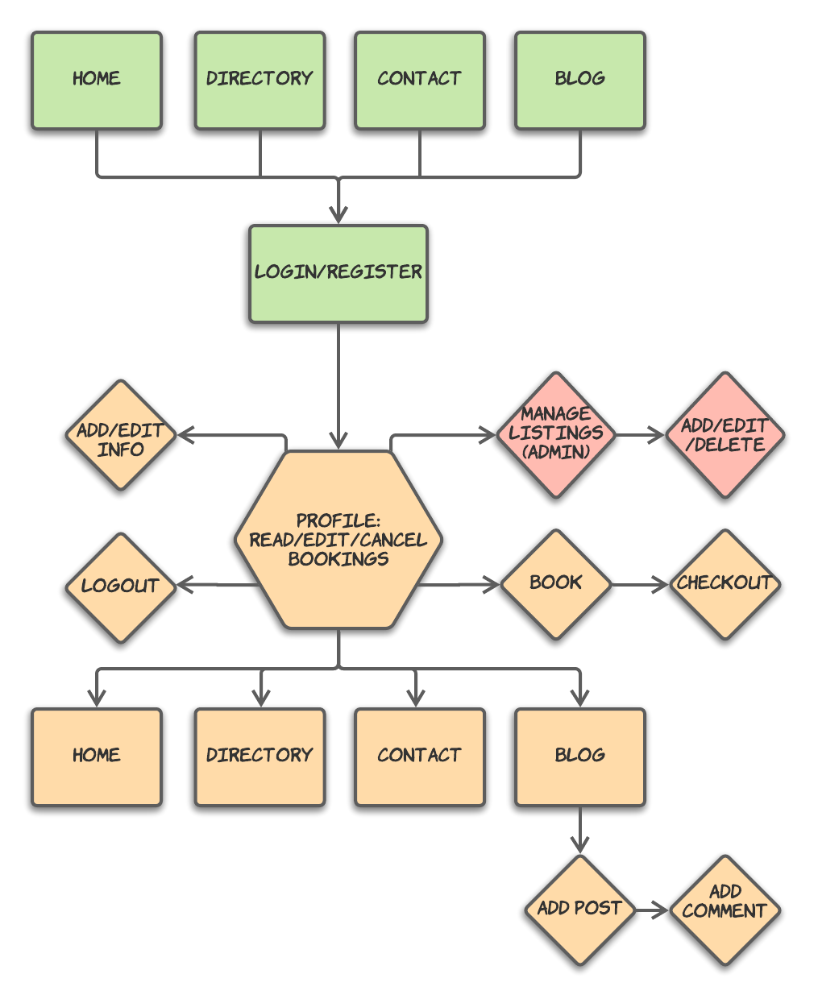
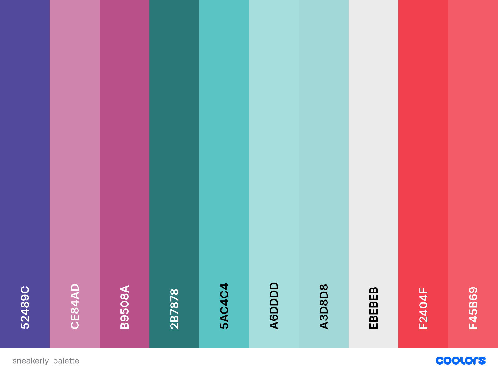
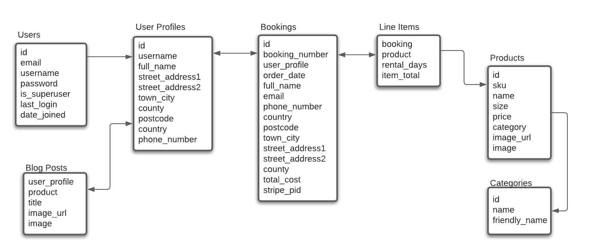

<h1 align="center">Sneakerly</h1>

[](https://ms4-sneakerly.herokuapp.com/)

[View the deployed site here.](https://ms4-sneakerly.herokuapp.com/)

Sneakerly is a sneaker rental website that allows users to rent premium sneakers from a reputable source. This website was created for submission as my Milestone Project 4 as part of the Diploma in Full Stack Software Development course with Code Institute.<br>
 
## User Experience (UX)

The sneaker industry is undergoing a period of huge growth, with popular sneakers selling out instantly from retailers, and being re-sold at after-market values much higher than the original retail value.<br>
This site advances the user's goals by allowing users to rent premium sneakers at affordable prices, allowing them to have the full experience of wearing sought-after styles, without needing to pay huge reseller prices, and without needing to compete against automated purchase bots on retailer websites.<br>
It advances the site owner's goals by providing them with a means to make money from rentals, and they will also be allowed to charge customers late/missing/damaged fees.<br>

The User Experience for this site was planned & developed using the [5 Planes of UX Design](https://medium.com/designcentered/ux-design-5-planes-method-b1b1d6587c05): Strategy, Scope, Structure, Skeleton, Surface.

### Strategy
#### User Stories

- **As a first-time visitor, I want to:**
    - Find out how the rental process works.
    - See a directory of products that are available to rent.
    - Register for an account on the site to allow me to rent a product.
    - Rent a product while authenticated.
    - Find answers to common questions I have about the business & products.
    - Contact the site owners with any questions not answered by the site information.
    - See a blog containing photos from regular site users.

- **As a returning visitor, I want to:**
    - Log in to my user profile.
    - See a list of past rentals.
    - See detailed information about past rentals.
    - Save my default delivery information.
    - Update my default delivery information.
    - See my current default delivery information.
    - Pre-fill the delivery information on the checkout page when booking a new rental.
    - Upload photos to the blog of the products in-use during my rental period.

- **As the site owner, I want to:**
    - Manage users, bookings, products, and blog posts.
    - Have superuser access to blog posts to moderate the content.
    - Receive emails to notify me of questions asked via the contact form.
    - Earn money from rentals by charging users up-front.

### Scope
#### Existing Features

- **Navbar with Site Logo:**
    - The navbar & site logo provide a visual design feature with the diagonal shaping. Upon scrolling down the page, the navbar automatically shrinks back to a regular shape. The navbar links provide a means for users to navigate the site.

- **Homepage with Hero Image & Lead Text:**
    - The hero image provides an immediate visual cue to introduce the type of products available on the site. Just below, the lead text describes the purpose of the site.

- **Homepage Instructions Summary:**
    - On the homepage, the main content section provides a brief description of how the site works, giving instructions on how to use the site to users. Accompanied by images and further informational cards further down the page, the user is concisely presented with all the information they need to get started using the site.

- **Registration:**
    - Provides functionality for users to create an account on the site, in order to rent products and access extra functionality on the site, such as adding blog posts. User input is validated, and upon successful registration, a User object is created in the database.

- **Login/Logout:**
    - Provided users who have registered an account to access their profile, and additional features only available to authenticated users.

- **Profile:**
    - Allows authenticated users to see their booking history, if applicable, and provides functionality to update/add their default delivery information via a form. Successful submission of this form creates a UserProfile object in the database. In the booking history, the user can click on the booking numbers to see full details of the rental.

- **Directory of Products:**
    - The "All Sneakers" directory page provides all users with a list of sneakers that are currently available to rent. Laid out in a grid format using cards to include product images, prices, categories, and a "Rent" button.

- **Product Detail Page:**
    - Provides product image & further details, and allows authenticated users to enter their rental start date, number of rental days, and continue to the next step of the booking process.

- **Rental Confirmation Page (Bag):**
    - Displays a summary of the user's booking before continuing to the checkout process. User's can choose to "Cancel" and return to the Product Detail page, or "Confirm" and continue to the Checkout page.

- **Checkout Page:**
    - Displays a summary of the rental details at the top of the page, providing an option for users to return to the Product Detail page once again via the "Adjust Dates" button. Provides users with a checkout form with validation, prefilled with their default delivery information if present. After clicking the "Complete Checkout" button, a full page overlay is displayed to prevent duplication of the payment if the button is clicked more than once.

- **Checkout Success Page:**
    - If the payment is successful, the user is redirected to a Checkout Success page, providing the user with their booking number, and the details of their booking. A booking confirmation email is sent to the user's email address.

- **Blog:**
    - Displays blog posts to all users, and allows authenticated users to add a blog post. When adding a post, the user can upload a photo of the product they have rented. Provides functionality for the superuser to edit and delete blog posts.

- **FAQs Page:**
    - Provides users with a list of answers to frequently asked questions about the site. Information is arranged in an accordian, to allow users to expand the question to see the answers they wish to see.

- **Contact Page:**
    - Allows users to contact the site owner with any questions not answered by information available on the site via a contact form with validation.

#### Future Planned Features

### Structure
#### Flowchart
- Flowchart created using [Lucidchart](https://www.lucidchart.com):<br>
    [](/readme-assets/images/sneakerly-flowchart-2.png)

### Skeleton
#### Wireframes
- Wireframes created using [Balsamiq](https://balsamiq.com/):<br>
    [Wireframes PDF](/readme-assets/sneakerly-wireframes2.pdf)

### Surface

- **Color Scheme:**
    - Chosen using [coolors.co](https://coolors.co/). This color palette was chosen to provide sufficient contrasting color options for accessibility purposes, including multiple shades of similar colors. The colors used were chosen to provide a fun, engaging design throughout the site's UI.<br>
    [](https://coolors.co/52489c-ce84ad-b9508a-2b7878-5ac4c4-a6dddd-a3d8d8-ebebeb-f2404f-f45b69)

- **Typography:**
    - [Newake Font](https://indieground.net/product/newake-font/) was chosen for the site's logo, and [Project Blackbird](https://pixelsurplus.com/collections/free-fonts/products/projekt-blackbird-free-sans-serif-font) was chosen for the site's text. These fonts were chosen to continue the cool, fun UI design theme.

- **Images:**
    - [Unsplash](https://unsplash.com/) was used to select the site's images, full image credits can be found in the [Media Credits](#media).

## Technologies Used

### Tools
- [GitPod](https://www.gitpod.io/)
    - Used as the preferred IDE for development.
- [Git](https://git-scm.com/)
    - Used via the Gitpod terminal for version control, with regular commits, and to push to GitHub & Heroku.
- [GitHub](https://github.com/)
    - Used to store the site's code repository.
- [Heroku](https://www.heroku.com/)
    - Used to host the deployed site.
- [Lucidchart](https://www.lucidchart.com)
    - To create the site's structural flowchart, and the site's data schema.
- [Balsamiq](https://balsamiq.com/)
    - To create the site's wireframes.
- [TinyJPG](https://tinyjpg.com/)
    - Used to compress the site's images to improve load times.
- [Techsini](http://techsini.com/multi-mockup/) 
    - Used to create the mockup image used in the README file.
- [favicon.io](https://favicon.io/)
    - Used to generate the site's favicon image.

### Front-End Technologies
- [HTML5](https://developer.mozilla.org/en-US/docs/Glossary/HTML5)
- [CSS3](https://developer.mozilla.org/en-US/docs/Web/CSS)
- [JavaScript](https://developer.mozilla.org/en-US/docs/Web/JavaScript)
- [JQuery 3.6.0](https://jquery.com/)
    - Used as the primary JavaScript library.
- [Bootstrap 5.0.2](https://getbootstrap.com/docs/5.0/getting-started/introduction/)
    - Used as a responsive front-end framework.

### Back-End Technologies
- [Python](https://www.python.org/)
- [Django](https://www.djangoproject.com/)
    - Used with Python as the full-stack web framework.
- [Django Allauth](https://django-allauth.readthedocs.io/en/latest/)
    - Used to create the site's authentication functionality.
- [PostgreSQL](https://www.postgresql.org/)
    - Used with Heroku to store the live site's relational database.

### APIs / Other
- [Twilio SendGrid](https://www.twilio.com/sendgrid/email-api)
    - Used via Python back-end to send emails to the site owner from the contact form.
- [Stripe Payments](https://stripe.com/en-ie/payments)
    - Used Stripe Elements via JavaScript for the Checkout's front-end card element, and to create payments from the back-end via Python.
- [Amazon AWS S3](https://aws.amazon.com/s3/)
    - Used to store the live project's static and media files

## Testing

Testing documentation can be found in the separate [TESTING.md](TESTING.md) file.

## Deployment
### Local Deployment
The following dependencies will need to be installed in order to run this application locally:
- [Python3](https://www.python.org/downloads) to run the application.
- [PIP](https://pip.pypa.io/en/stable/installing) to install app requirements.
- [GitPod](https://www.gitpod.io/) or any preferred IDE, such as [VSCode](https://code.visualstudio.com/).
- [Git](https://git-scm.com/book/en/v2/Getting-Started-Installing-Git) for cloning and version control.

Follow the below steps for local deployment:

1. Clone the GitHub repository by entering the following command into the Git terminal:
    - `git clone https://github.com/adowlin/project-4-sneakerly.git`
2. After cloning the project, the below environment variables need to be set, either in your IDE's config vars, or in an `env.py` file. Use your own credentials for the values where appropriate.
    - `DEVELOPMENT` - Set to `True`
    - `SECRET_KEY` - The Django secret key. This can be generated from the [Django Secret Key Generator](https://miniwebtool.com/django-secret-key-generator/).
    - `SENDGRID_API_KEY` - This will need to be copied from the [SendGrid Account Setting Page](https://app.sendgrid.com/settings/api_keys). A free SendGrid account can be created [here](https://signup.sendgrid.com/).
    - `STRIPE_PUBLIC_KEY` - This will need to be copied from the Publishable key on the [Stripe Dashboard API Keys Page](https://dashboard.stripe.com/test/apikeys). A free Stripe test account can be created [here](https://dashboard.stripe.com/register).
    - `STRIPE_SECRET_KEY` - This will need to be copied from the Secret key on the [Stripe Dashboard API Keys Page](https://dashboard.stripe.com/test/apikeys).
3. Create a `.gitignore` file, and add the `env.py` file, if present, to the list of files.
4. Install all requirements from the [requirements.txt](requirements.txt) file using this command:
    - `pip3 -r requirements.txt`
5. Run the app using the following command in the terminal:
    - `python3 manage.py runserver`
6. The Django server should now run locally.
7. After running the Django server for the first time, a new SQLite3 database file should be created automatically.
    - `db.sqlite3`
8. You will then need to make migrations using the below commands to create the database schema.
    - `python3 manage.py makemigrations`
    - `python3 manage.py migrate`
9. To load the Categories and Products data from their respective JSON fixture files, you will need to run the below commands in the order listed, since the Products data relies on the Categories data.
    - `python3 manage.py loaddata categories`
    - `python3 manage.py loaddata products`
10. Next, create a `superuser` in order to access the Django Admin Panel, by running the below command and following the subsequent prompts.
    - `python3 manage.py createsuperuser`
11. Once complete, Django should migrate the `migrations.py` files from each app to configure the below relational data schema.<br>
[](/readme-assets/images/sneakerly-data.png)

### Remote Deployment
To deploy this app on Heroku, the following steps were taken:

1. Create a `requirements.txt` file so Heroku can install the required dependencies.
    - `pip3 freeze --local > requirements.txt`
2. Create a `Procfile` containing information about the type of app that will be deployed.
    - `web: gunicorn sneakerly.wsgi:application`
    - Make sure to delete the blank line at the end of the Profile, as this can cause issues when deploying to Heroku later.
3. Create a Heroku account [here](https://signup.heroku.com/), create a project app, and click the "Deploy" tab. 
4. "Connect GitHub" as the Deployment Method, and select "Enable Automatic Deployment".
5. Go to the "Resources" tab in your Heroku app, and in the Add-Ons section, search for the Heroku Postgres add-on.
    - The free "Hobby" level can be selected.
6. In the Heroku "Settings" tab, click the "Reveal Config Vars" button to configure the environment variables as outlined below, with your own credentials where appropriate.
    - `DATABASE_URL` - Set to your Postgres database URL from the previous step.
    - `SECRET_KEY` - The Django secret key. This can be generated from the [Django Secret Key Generator](https://miniwebtool.com/django-secret-key-generator/).
    - `STRIPE_PUBLIC_KEY` - This will need to be copied from the Publishable key on the [Stripe Dashboard API Keys Page](https://dashboard.stripe.com/test/apikeys). A free Stripe test account can be created [here](https://dashboard.stripe.com/register).
    - `STRIPE_SECRET_KEY` - This will need to be copied from the Secret key on the [Stripe Dashboard API Keys Page](https://dashboard.stripe.com/test/apikeys).
    - `EMAIL_HOST_USER` - Your own email address that you wish to use for the site.
    - `EMAIL_HOST_PASS` - A generated App Password from your email provider's settings. For this project, Gmail was used: https://support.google.com/accounts/answer/185833?hl=en 
7. Update the project's `settings.py` file to connect to the remote database using the `dj_database_url` package.
8. You will then need to make migrations again using the below commands to create the database schema.
    - `python3 manage.py makemigrations`
    - `python3 manage.py migrate`
9. Load the Categories and Products data once again from their respective JSON fixture files. You will need to run the below commands in the order listed, since the Products data relies on the Categories data.
    - `python3 manage.py loaddata categories`
    - `python3 manage.py loaddata products`
10. Next, create a new `superuser` in order to access the Django Admin Panel on the deployed site, by running the below command and following the subsequent prompts.
    - `python3 manage.py createsuperuser`
11. Create a free Amazon AWS account [here](https://portal.aws.amazon.com/billing/signup#/start).
    - Amazon AWS S3 will be used to host the site's static and media files.
12. Navigate to the [S3 page](https://s3.console.aws.amazon.com/s3/home?region=eu-west-1) from the AWS Console.
13. Create a new S3 bucket, and follow the next steps to configure the bucket & complete setup.
    - In Permissions > CORS configuration, paste in the below configuration code:
    ```
    [
        {
            "AllowedHeaders": [
                "Authorization"
            ],
            "AllowedMethods": [
                "GET"
            ],
            "AllowedOrigins": [
                "*"
            ],
            "ExposeHeaders": []
        }
    ]
    ```
    - In Permissions > Bucket Policy, click "Edit", then "Policy Generator", and generate a policy. Paste the policy code back into the "Bucket Policy", and save.
14. Navigate to the the [IAM section](https://console.aws.amazon.com/iam/home?region=eu-west-1#/home) of the AWS console, and follow the below steps to configure:
    - Create a new "Group", and attach your S3 Bucket.
    - Create a new "Policy", and attach to the group created in the previous step.
    - Create a new "User" and attach to the same group. Download the new user credentials `.csv` file.
15. In Heroku's Settings tab, add the below variables to your app's config variables, using your own user's credentials as the values:
    - `AWS_ACCESS_KEY_ID`
    - `AWS_SECRET_ACCESS_KEY`
16. In your development IDE's console, run the below command to push the static and media files to AWS.
    - `python3 manage.py collectstatic`
17. The app should now be deployed to Heroku - click the "Open App" in the Heroku dashboard button to view the deployed site.

## Credits

### Content
- Glassmorphism CSS effect used on mobile navigation modal adapted from: https://ui.glass/generator/
- README file template adapted from: https://github.com/Code-Institute-Solutions/readme-template
- Deployment section of README file adapted from: https://github.com/TravelTimN/ci-milestone05-fsfw#deployment

### Media
- [Techsini](http://techsini.com/multi-mockup/) was used to create the mockup image used in the README file.
- [favicon.io](https://favicon.io/) used to generate the site's favicon image.
- [Unsplash](https://unsplash.com/) was used for sourcing the images used on the site:
    - Hero Image: https://unsplash.com/photos/jvoZ-Aux9aw
    - Cleaning Image: https://unsplash.com/photos/JM-qKEd1GMI
    - Authentication Pages Image: https://unsplash.com/photos/tEv2tuos01M
    - Profile Image: https://unsplash.com/photos/FHb3W_1idVs
    - Contact Image: https://unsplash.com/photos/H_Y6njzNUmw
    - Blog Image: https://unsplash.com/photos/l76tzNZhsok
    - Product Images:<br>
        https://unsplash.com/photos/aDZ5YIuedQg<br>
        https://unsplash.com/photos/76w_eDO1u1E<br>
        https://unsplash.com/photos/1vy2QcZd5FU<br>
        https://unsplash.com/photos/7F6POgyc09w<br>
        https://unsplash.com/photos/DMl5gG0yWWY<br>
        https://unsplash.com/photos/ntnAuagWMI8<br>
        https://unsplash.com/photos/updW-QUccFE<br>
        https://unsplash.com/photos/pu-PgXMI30I<br>
        https://unsplash.com/photos/Mh8DaC36FQo<br>
        https://unsplash.com/photos/6r280_Z7Efc<br>
        https://unsplash.com/photos/tBdkpxj3A7Q<br>
        https://unsplash.com/photos/hv36zK2ivyo<br>
        https://unsplash.com/photos/WrMW-GUbCng<br>
        https://unsplash.com/photos/Eip7D2OybzA<br>
        https://unsplash.com/photos/kKObh7tUPNc<br>

### Acknowledgements